# __MadMiners SMP__

This project is dedicated to the MadMiners SMP Minecraft server.
It provides the viewers with facts about the server and its members, states the community's values and offers a way to apply for a server membership.

The page can be linked in the members' YouTube videos or be offered to people looking for a server to join.  
Visit the deployed project [__HERE__](https://madmaddie81.github.io/mad-miners-smp/index.html)

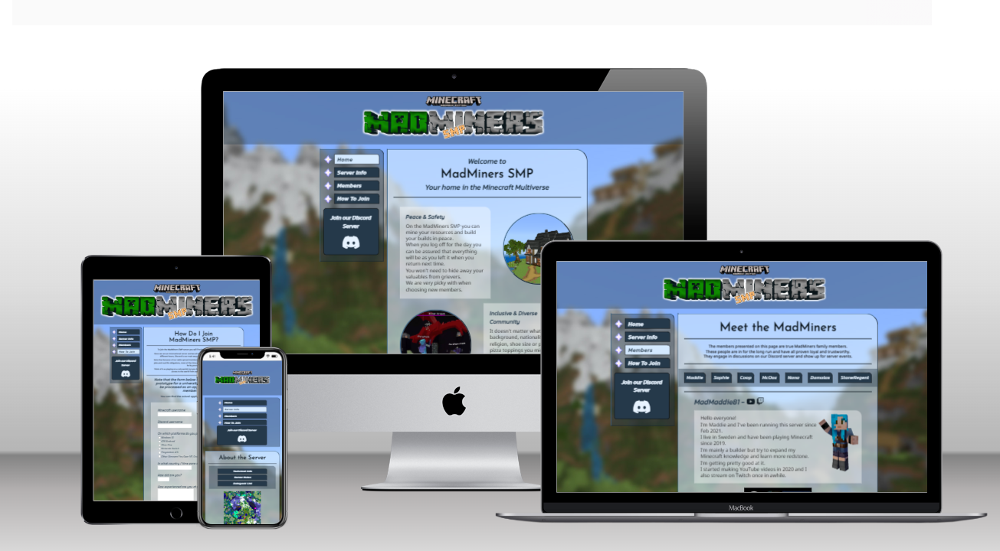

## __Features__

### __The Core Elements__

These are the features that will companion the viewer through all the pages and bring cohesiveness to the project.

#### __The Background__

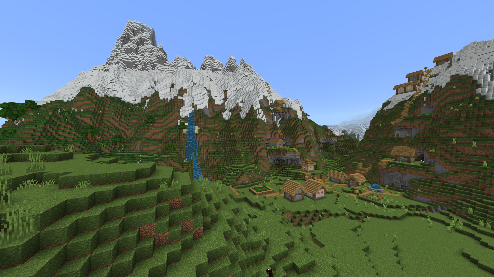
* The original image used for the background is a screenshot from day one of the current season of the MadMiners server. 
* It depicts a gorgeous mountain landscape with a pittoresque village that starts in the valley between the mountains and then climbs up the mountain to the right.
* This is the view you are met with when logging onto the server for the first time.
* The picture has been blurred up in Photoshop to not take focus away from the content of the site.
* The background is fixed in position and will stay put as the viewer scrolls through the pages.
* Many of the elements on the site has a background colour with lowered opacity to allow for the background picture to shine through.

#### __The Header__

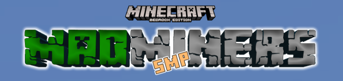

* All the way at the top the official Minecraft Bedrock Edition logo presides, eliminating all doubt of what version of the game the server is hosting.
    * There are two editions of the game; Minecraft Bedrock, which is written in C++ and is accessible on all major consoles as well as Windows 10 and iOS/Android. The other version is Minecraft Java, and as the name says it's written in Java and is basically only accessible on PC. Both versions has their pros and cons.
* The header's other feature is a MadMiners SMP logo I created in Photoshop using the same style and font as the official Minecraft logo.
    * SMP is an abbreviation of Survival Multiplayer, which is a common playstyle in Minecraft.

#### __The Navigation Bar__

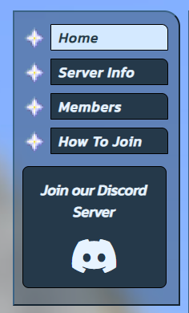 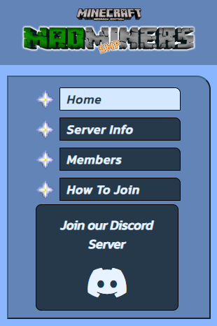

The navigation bar is the fully interactive main hub of the project that will easily bring the viewer to all corners of the site as well as an external link to the MadMiners Discord server.
* Note the shape of the navigation bar field and the navigation buttons, with one rounded corner. This feature will echo throughout all parts of the project.
* On large screens the navigation bar appears in the upper left corner, next to the main section.
    * The location leaves plenty of room for future expansion of the site and the empty space below could be used for additional features, such as advertisement or external links.
* On smaller screens the navigation bar is located between the header and the main section.
* All buttons will react with a colour change when hovered over.
* To the left of every navigation button you will find a cute little gif of a nether star.
    * The nether star is one of the rarest and most valuable items in the game and resembles a compass star, which seemed suitable as a link marker.
* At the bottom of the navigation bar we have a comparible large button that will bring you to the MadMiners Discord server.
    * The link will open in a new tab, unless you are on a mobile device with the Discord app installed. Then the link will open up the app.
    * The size of the button emphesises the importance of the Discord server.
    * No one will be allowed to join the Minecraft server without also be a part of the Discord community.
    * The Discord server is open for everyone and isn't just reserved for the MadMiners members.
    * Besides the text, the button also has a big Font Awesome icon of the Discord logo.

#### __The Footer__
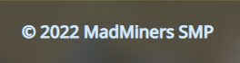
* The footer is very simple and contains a darker coloured strip and a copyright disclaimer.
* It still fills an important role as it counterbalances the header and lets the viewer know that they have reached the bottom of the page.

#### __Favicon__
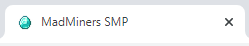
* All pages are decorated with a diamond favicon.
* The favicon appears on the browser tab and helps the viewer identify the correct website when several tabs are open.

### __The Landing Page__

The purpose of the landing page is to give the viewer a plesant first experience of the site and efficiently provide information about what type of server the MadMiners is.

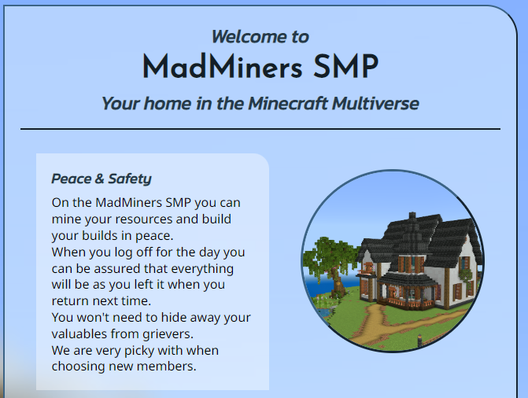

* When the viewer arrives to the site they are immediately presented with a welcoming message. 
* After that they can read about the server values, accompanied by appropriate images from the server.
    * A nice house represents the ability to play the game in peace without having to worry about thieving and destructive neighbours, which is a common occurance on most public servers.
    * The second image shows some server members working together to defeat the ender dragon. This picture speaks for the inclusive, non-toxic community we have on the MadMiners SMP.
    * Lastly, the text about a high quality server is accompanied by a picture of a collection of automatic redstone farms. Redstone can be seen as a mix between mechanics and magic and is usually very appealing to the engineers, mathematicians and developers that try their hand at Minecraft. It has the potential to lag down the game and even crash a server if done wrong, but is very rewarding when done right.

### __The Information Page__

The purpose of the Info page is to give all the information the viewer might need when considering wether to apply for server membership. It tells about what the player can expect from the server, and what is expexted of them in return.

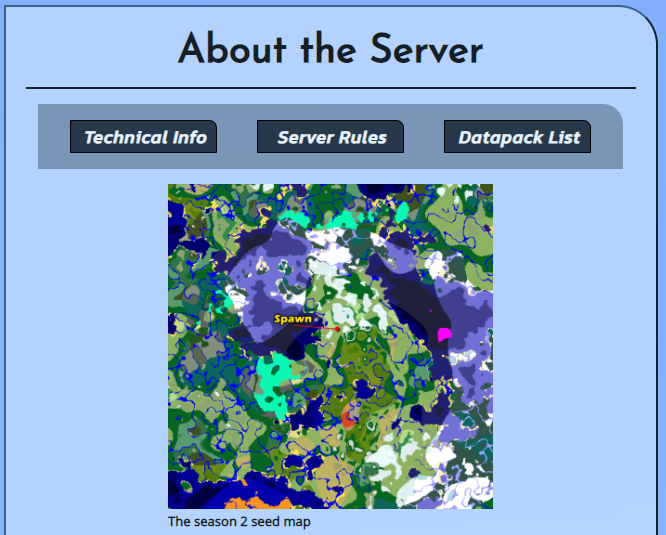

* The info page is divided into four segments. 
* The first segment (depicted above) has the page header, an interactive local navigation bar that gives the viewer efficient access to the other three segments, and a map over the main area of the MadMiners world.
    * The distance from the east border of the map to the west border is about 8km.
    * A marker has been put down to point out where you will spawn when first arriving to the server.
    * The white areas north and east of the provided spawn point is the mountains depicted on the site's background image.
* The next segment you get to is the server's technical data.
    * Here you will find a link to our server host. Nodecraft. This link will open in a new tab.
    * The world seed and spawn location information can be used to visit the world the server is based on in the viewer's own version of the game.
* Next we have the Server Rules segment.
    * This educates potential member applicants of what is and isn't accepted behaviour on the server.
* The last segment is a long list of all the the ways the game has been customised and tweaked on the MadMiners to ensure an optimal player experience.
* Below each segment you will find a dividing line with a button that efficiently brings you back to the top of the page.

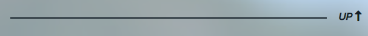

### __The Members Page__
Next we have the Members Page.  
This page was made to honour some of the server's most prominent members.

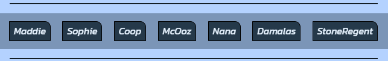

* Once again we have a local navigation bar for quick access to all the different members' sections.

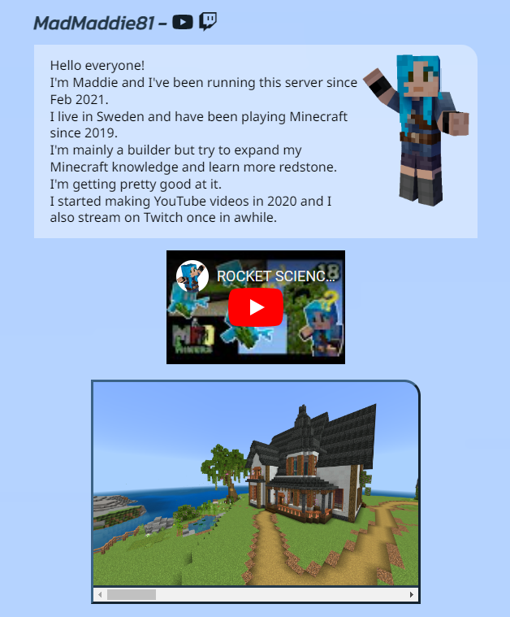

* Each member presentation consists of a short presentation, a picture of the player's in-game avatar and a scrollable gallery of some of their builds from the server.
* Some of the presentations has been written by the members themselves, and some has been provided by me.
* Those of the members who are content creators has their channels linked next to their name, represented by Font Awesome icons. These links will open in a new tab.
* The YouTubers also has one of their videos embedded in their presentation. The videos does not autoplay and has working controls.
* Below each member we once again find the dividing line with the UP-button we previously saw on the Info Page.

### __The Signup Page__

The last page accessible from the navigation bar is the How To Join page.  
The page begins with a short description of what the player experience on the server is like.

* This project was created as a part of a university course and the form provided on this page will not actually sign you up for server membership.
* A big disclamer has been provided on the page and once again points to the importance of the Discord server, where the actual application form can be found.
* However, it's fully possible to fill in and submit the form.
    * To be allowed to submit the form all data has to be filled in, except the question about your Minecraft experience, which isn't mandatory to answer.
    * Since the server is for adults only the form won't let you submit an age lower than 18. It also limits the age to double digits since it's very unlikely for applicants to have a three digit age.

### __The Thank You Page__

This is just a simple page you will reach by submitting the signup form.  
The page still has access to the main navigation bar, which will bring you back to the rest of the site's content.

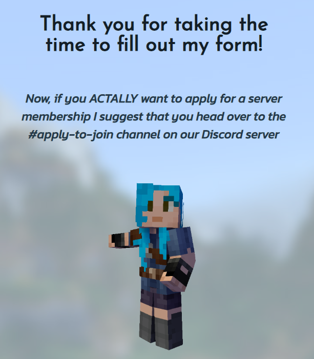

### __The 404 Page__

* If the viewer tries to navigate to a broken link they will be brought to the 404 page.
* From this page you can easilly navigate your way back to the other pages without needing to use the browser's back-button.
* The page has a nice picture of Maddie and Coop chatting on a balcony.

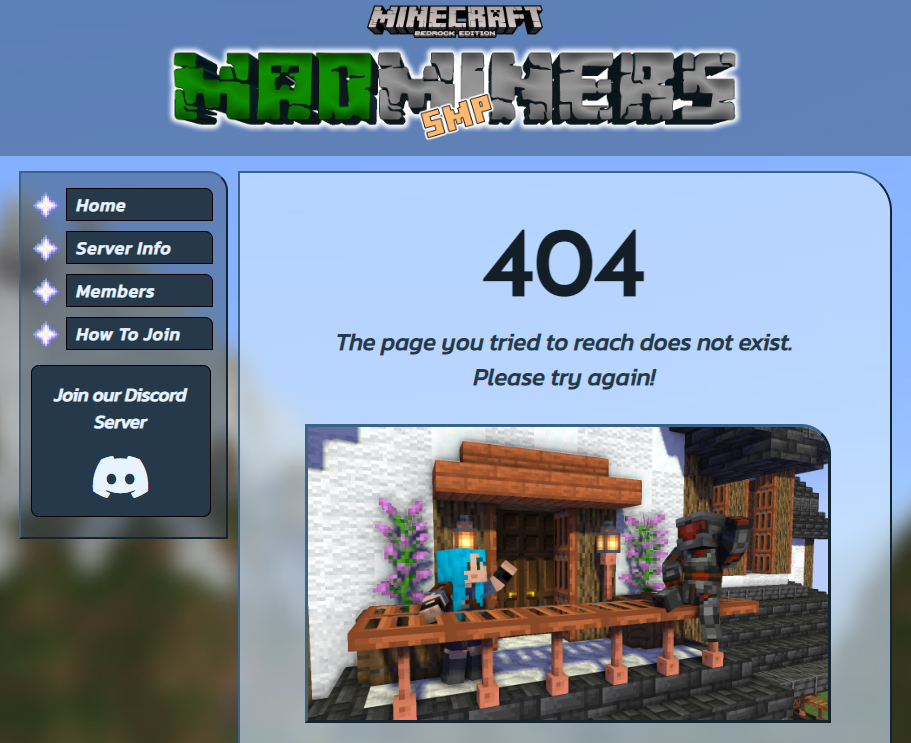

### __Existing Features__

* Responsive design that looks good on screen widths from 320px and up.
* All external links opens in new tabs and has proper aria labels.
* All information needed for potential new server members.
* Embedded YouTube videos on the Members page.
* Scrollable picture galleries on the Members page.
* Signup form with connected Thank You page.
* 404-page with access to the navigation bar.

### __Features Left To Implement__ 

* Several more pages, such as a Q&A-page and a Downloads page for previous seasons' world files.
* A fully working application form to join the MadMiners.
* Change out the scrollable galleries for more elegant carousels with the help of JavaScript.
* More elegant navigation bars with the help of JavaScript.

## __Design & Techniques__

* When I first started this project I began with figuring out the basic layout and looks of the core elements in __Photoshop__. 

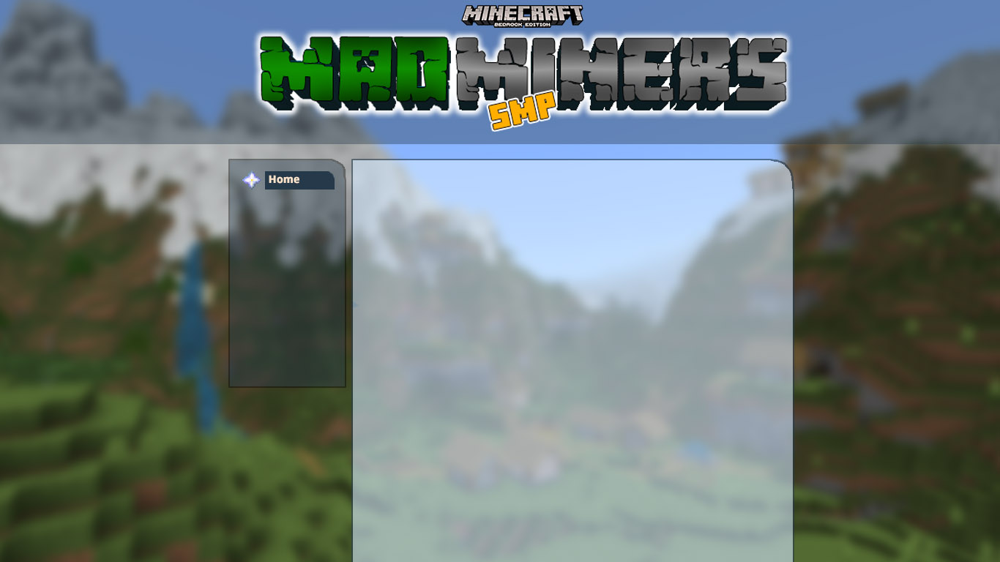

* After that I recreated my design with HTML and CSS using __Gitpod__.
* The member avatars and the image on the 404 page was created with a Minecraft 3d animation program called __Mine-imator__

## __Testing & Bugs__

### __Responsiveness__

* All pages has been thoroughly tested for screen sizes from 320px and up.  
* Besides checking the pages' responsiveness with the Chrome Developer tools, the pages has regularly been tested in Edge and Safari, on PC, iPhoneXR and iPadAir, both in vertical and horizontal mode.
* The site is responsive on all screen sizes and no images are pixelated or stretched. No unwanted horizontal scroll is present. No elements overlap.
* I have tested that every single link on the site work as intended, opens in the correct tab and send you to the right part of the page.

### __Code Validation__

* __HTML:__ The code of all pages passed through the official [W3C validator](https://validator.w3.org/) without any problems.
* __CSS:__ The CSS code made it through the [Jigsaw validator](https://jigsaw.w3.org/css-validator/) without errors.

### __Accessibility__

* All pages has had their accessibility checked by [Wave](https://wave.webaim.org/) without any remarks.
* All navigation links has proper aria labels.
* No contrast issues has been found.

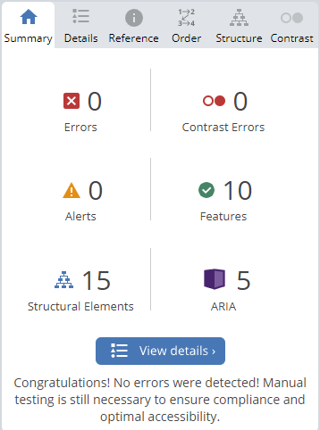

### __Unfixed Bugs__
* I have a problem with the scroll galleries on the Members page on devices using mouse and keyboard.
    * If you click on the forward or backward arrows on the scrollbar the gallery pass by all pictures and goes straight to the end.
    * If you click and drag the scroll indicator it moves between the images properly.
    * On touch screens the galleries scroll flawlessly.
    * I spent way too many hours Googling the issue but had to admit defeat. I believe the issue is connected to the scroll-snap-align feature, but I wasn't able to solve the problem.
    * I decided to leave the bug in until I can switch out the entire gallery for a carousel or slideshow using JavaScript.
* The Members page is also very picture heavy and load slowly on devices with a slow connection.
    * This issue could easily be fixed by reducing the file sizes instead of just using the raw screenshots.
    * The reason this hasn't been fixed is simply that I ran out of time. This project got way bigger than I had intended when I started it and I had to prioritize making sure that I submit a cohesive, nice looking website for evaluation.

## __Deployment__
The project was deployed to GitHub Pages using the Main Branch source.  
Watch the website [__HERE__](https://madmaddie81.github.io/mad-miners-smp/)

* All code and files has been submitted to Github by using the Git commands 'git add', 'git commit' and 'git push'
* GitHub pages can be reached through opening the Settings tab in the GitHub repository.

## __Credits__

### __Content__

* The layout is inspired by the [Hermitcraft](https://hermitcraft.com/) website.
* I used the [Love Running project](https://github.com/MadMaddie81/love-running/blob/main/assets/css/style.css) we did for class as reference when writing the media queries.
* The icons used were provided by [Font Awesome](https://fontawesome.com/)

### __Media__

* The Minecraft logo in the header, the nether star gif in the navigation bar and the favicon diamond has been borrowed from the [Minecraft Wiki](https://minecraft.fandom.com/wiki/Minecraft_Wiki)
* The map on the Info page comes from [Chunkbase](https://www.chunkbase.com/)
* All other artwork has been created by myself.

